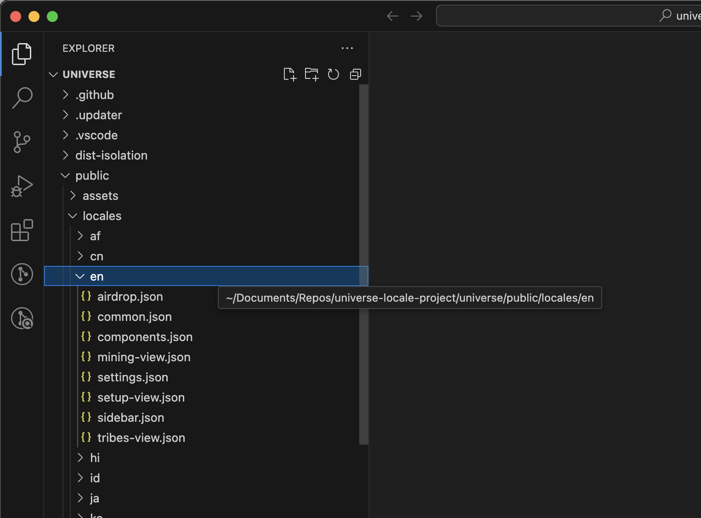
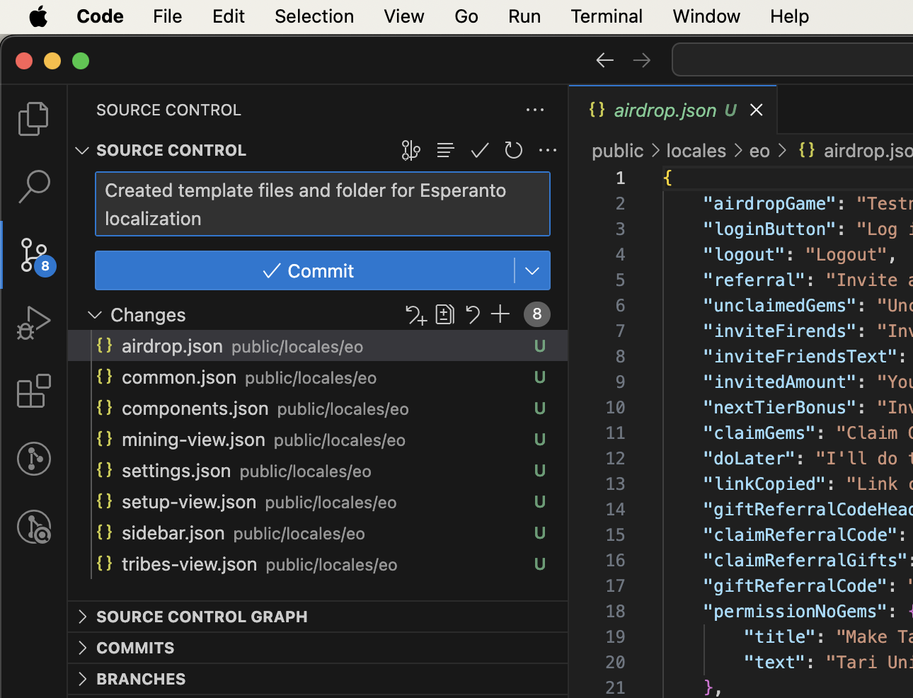

At Tari, our approach has always leaned towards greater usability. Tari Universe, our desktop mining app, provides an easy entry point for those unfamiliar with the more complicated aspects of setting up and mining Tari. Right now, Tari Universe has a limited number of languages available; with your help, we’d like to expand the selection.

Adding a new language is a great way to dip your feet into the world of open-source projects, and requires minimal programming skills. Whether you're familiar with programming or are looking for a way to start familiarising yourself with development, this guide is for you. We’ll explain how to go about contributing new languages - or localizations - to Tari Universe.

# Getting started

To contribute a localization, you’ll need these at the bare minimum:

- A GitHub account
- A fork of the Tari Universe repository.
- Git

However, this guide assumes the use of VS Code as your integrated development environment (IDE). This has some additional prerequisites, such as installing the IDE itself and supporting applications such as Git, nvm, Rust, and more.

Most of the above is covered in our [“Setting up your development environment” guide](/lessons/08_setting_up_development_environment.html). If you're not already familiar with development practices and tools, this is a good place to start.

In this guide, we’ll cover the following:

- Creating a GitHub account
- Checking whether the localization you want to add already exists
- Creating a fork of the Tari Universe project and new branch within your fork to begin working on the new localization.
- Explain how localization works in Tari Universe
- Explain the purpose of the different localization files and factors to keep in mind when translating.
- Committing your localization for review and inclusion in Tari Universe via a pull request.

## Step 1 - Create a GitHub account

If you already have a GitHub account, you can skip this step. To sign up to GitHub, follow the instructions provided [at GitHub’s documentation site](https://docs.github.com/en/get-started/start-your-journey/creating-an-account-on-github).

While the steps may vary over time, you will need to perform the following actions:

- Provide your desired username, password, and email address
- Verify your email address

Once you’re done, you’ll be redirected to the GitHub dashboard.

A useful introduction to basic development concepts is the [Hello World tutorial provided by GitHub](https://docs.github.com/en/get-started/start-your-journey/hello-world). This tutorial introduces new users to the basics of development within GitHub and covers basic concepts such as repos, branches, commits, and more.

## Step 2 - Check the current localizations

Before you start working, you need to check if the localization you want to add already exists or not. Go to the [Tari Universe project](https://github.com/tari-project/universe/tree/main/public/locales) and browse through the locales folders for currently available localizations.

If the one you wanted to add already exists, you can still contribute! Localization requires writers, proofreaders, and editors; all are necessary to ensure quality translations. You can simply work on an existing localization you're interested in. We’ll explain this in more detail from Step 5.

## Step 3 - Forking the Tari Universe repo

Next, we will fork the Tari Universe repo. Forking the Tari repo allows you to create your copy of the Tari Universe codebase, independent of the original project. This will allow you to safely modify the codebase without impacting the main project.

Make sure you are logged into your GitHub account, then navigate to the Tari Universe repo **[here](https://github.com/tari-project/universe)**. Look to the top-right corner of the screen for the **Fork** button.


Click on the drop-down and note the forks available. It should be blank. Click on the **Create a new fork** option to bring up the **Create a new fork** form.


When filling out the form, keep the following in mind:

- The owner should be your GitHub username
- The repo name will be automatically filled in based on the repo name from the existing project. Leave it as is.
- You can provide a description of the project. Descriptions and comments are a good habit to get into, so fill this out with a suitable description.
- Make sure the **Copy the main branch only** option is checked. If you uncheck the option, you will copy all available branches from the existing repo, which will make things difficult to manage.

Click the **Create fork** button to continue.

Once you’ve done so, there’ll be a brief delay while GitHub creates the fork, then you’ll be redirected to the new fork’s home page. Look at the top-left corner, and you should see something that reads **[Your Username]/[Your Repo Name]**. This is a good way to check that you are on the right repo. Additionally, you’ll see a message under the repo that reads, “forked from tari-project/universe” and is a quick indicator that you’re on your fork.


## Step 4 - Creating a new branch for your localization work

Now that you have your own fork of the project, you will need to create a new branch. Branching creates a copy of the code at a specific point in time, allowing you to work on your changes without impacting the work of others.

Open up VS Code, and ensure you have your repository open. If you're not sure what is meant by this, be sure to check out the [“How to Become a Tari Contributor” guide](/lessons/how_to_become_a_tari_contributor.html) and confirm you've completed the necessary steps before continuing.

- At the bottom-left corner of VS Code’s status bar, click on the “main” branch. In the Command Palette at the top of VS Code, you will see that you have the option to create a new branch.
- Select the **Create Branch** option and give it an appropriate name. The standard convention is to avoid spaces and use hyphens in their place; for example, “new-localization-esperanto”. If you are editing an existing localization, this might change to, for example, “proofreading-french-localization” or "editing-french-airdrop-json".
- Once you’ve created the branch, you will notice that the status bar’s branch has been updated to whatever you called your new branch. However, you will still need to publish the new branch.
- Click on the little cloud upload button next to the branch. In the Command Palette, you will have the option of publishing it to **Origin** or **Upstream**. Select **Origin**. You will now see the new branch in your list.

Congratulations! You’re now ready to start working on your localization.

## Step 5 - Getting to grips with Tari Universe's language system

When launching for the first time, Tari Universe uses the user's system locale to determine which language the application should display. If the system locale is unavailable, the initial language displayed will be English.

Available languages for Tari Universe are available in a drop-down within the **Settings → General Settings** section of the application. The user can also select to use the system’s language (or locale) to determine which language Tari Universe will use.


These languages are derived from the Tari Universe project - specifically, from the ~/public/locales folder. Each locale consists of several JSON files stored in a folder that utilizes the [ISO-639 standard Set 1 two-letter naming convention](https://en.wikipedia.org/wiki/List_of_ISO_639_language_codes) for languages. In VS Code, go to the Explorer Tab, expand the public/locales folder, then select the **en** locale folder.



In addition, in order for the language to be available in the system, you'll need to update the **i18initializer.ts** file, located in src/i18initializer.ts. Here, you'll need to add your language and the regional variations associated with it so Tari Universe knows how to resolve different system configurations. If are working in an existing localization, you can skip this.

### Step 5a - Understanding how the localization JSONs work

Each JSON file corresponds to a different part of the app. Let’s have a look inside the **setup-view.json** file, which contains many of the start-up messages displayed when Tari Universe boots up:

```json
{
    "setting-up": "Setting up the Tari truth machine...",
    "this-might-take-a-few-minutes": "This might take a few minutes",
    "dont-worry": "Don't worry, next time it won't take as long",
    "title": {
        "starting-up": "Starting up",
        "checking-latest-version-gpuminer": "Checking for latest version of xtrgpuminer",
        "checking-latest-version-node": "Checking for latest version of node",
        "checking-latest-version-mmproxy": "Checking for latest version of mmproxy",
        "checking-latest-version-wallet": "Checking for latest version of wallet",
        "checking-latest-version-xmrig": "Checking for latest version of xmrig",
        "checking-latest-version-sha-p2pool": "Checking for latest version of sha-p2pool",
        "waiting-for-wallet": "Waiting for wallet",
        "waiting-for-node": "Waiting for node to sync",
        "preparing-for-initial-sync": "Connecting to network peers {{initial_connected_peers}}/{{required_peers}}",
        "starting-mmproxy": "Starting merge mining proxy",
        "starting-p2pool": "Starting P2Pool",
        "application-started": "Applications started",
        "downloading": "Downloading",
        "download-completed": "Download completed",
        "waiting-for-header-sync": "Waiting for header sync. {{local_height}}/{{tip_height}} headers synced",
        "waiting-for-block-sync": "Waiting for block sync. {{local_height}}/{{tip_height}} blocks synced"
    },
    "new-tari-version-available": "A new version of Tari Universe is available!",
    "would-you-like-to-install": "Would you like to install Tari Universe {{version}} now?",
    "yes": "Yes",
    "no": "No"
}
```

As we can see, **setup-view.json** consists of several variables that hook up to UI elements in Tari Universe. Text strings are stored against each variable, and Tari Universe displays that text. So while the variable name will always remain the same, the text string will change when a user selects a different locale.

Returning to the contents, there are additional elements to consider. Looking at the **title** variable, note several additional fields associated with it in their own set of braces, starting with **starting-up** and continuing through to **waiting-for-block-sync**. The **title** variable is a property whose text will change depending on the state of the variable; in this case, as Tari Universe gets to a new setup step, the title text will change to reflect the step it is currently on.

Lastly, some of the strings have text enclosed in braces, such as the string, **“Would you like to install Tari Universe {{version}} now?”**. These are variables that Tari Universe calls and inserts into displayed text so it can be dynamically updated. When editing these messages, ensure these variables remain unaltered.

### Step 5b - Understand how the i18initializer.ts file works

Again, you can skip this step if you are working on existing localizations. Below is a sample i18initializer.ts. We've limited it to two languages to keep the code snippet brief - the actual file will list all of the languages displayed.

```
import i18n from 'i18next';
import { initReactI18next } from 'react-i18next';
import LanguageDetector from 'i18next-browser-languagedetector';
import HttpBackend from 'i18next-http-backend';

export enum Language {
    PL = 'pl',
    AF = 'af',
}

// System can have various regional variations for language codes, so we resolve them
export const resolveI18nLanguage = (languageCode: string): Language => {
    switch (languageCode) {
        case 'pl':
        case 'pl-PL':
            return Language.PL;
        case 'af':
        case 'af-ZA':
        default:
            return Language.EN;
    }
};

// Language names for display
export const LanguageList: Record<Language, string> = {
    [Language.PL]: 'Polski',
    [Language.AF]: 'Afrikaans',
};

// Initialize i18n with new supported languages
i18n.use(HttpBackend)
    .use(LanguageDetector)
    .use(initReactI18next)
    .init({
        lng: Language.EN,
        compatibilityJSON: 'v4',
        fallbackLng: Language.EN,
        backend: {
            loadPath: '/locales/{{lng}}/{{ns}}.json',
        },
        supportedLngs: [
            Language.PL,
            Language.AF,
        ],
        saveMissingTo: 'all',
    });
```

So there are four areas you would need to edit:

- Within **export enum Language**, you will need to add your new localization's language code. You can do so by matching the two-letter code you noted in previous steps.
- Within **switch (languageCode)**, you need to add the various regional locales that might map to your localization. This is usually a combination of the language code and the country code (derived from the ISO-3166(https://en.wikipedia.org/wiki/ISO_3166-1 codes). So for example, English would have 'en', 'en-GB', 'en-US' and so on to represent the variations available. This is appended **return Language.[YourCode]** which you defined in **export enum Language**
- Within **export const LanguageList**, you'll need to include a line that tells the system what it should call the language in the Languages drop-down list.
- Lastly, inside **supportedLngs:**, you'll need to add your language to the list.

If you're concerned or feel uncomfortable editing any of the above, you can skip it; the project maintainers will, if the localization is accepted, hook up your language in the system.

## Step 6 - Duplicate an existing locale folder

The easiest way to get started is to duplicate one of the existing locale folders. You can skip this step if you are simply going to be editing an existing localization.

First, check what the ISO-639 Set 1 code is for the language you are adding. You can get a [full list here](https://en.wikipedia.org/wiki/List_of_ISO_639_language_codes).

Right-click on the locale folder in VS Code's Explorer and select the **Create Folder** option. You will see a new, blank folder is created. Enter the two-letter code you noted earlier to create the folder.

Next, select all the files in the **en** folder, right-click, and select **Copy**. Then, open your newly created folder, right-click, and select **Paste**. The files will be copied into the folder as new files.

Note that each of these files has a **"U"** against it. You need to commit these changes to your local repository so that VS Code can start tracking changes against the files.

> **_TIP:_** Commit changes often. Getting into the habit of committing your changes regularly ensures your changes are saved, making it easy to revert changes if required.

Go to the Source Control tab and open up the Changes panel. The new folder and files you created will be listed here. You will need to commit these changes to the repository. In the comment section, provide a short comment explaining what the changes are - an example would be “Created template files and folder for Esperanto localization” - and press the **Commit** button.



You’ll be warned that this is not a staged commit and asked if you wish to commit this directly. Select **Yes** to continue. You’ll notice that the **Commit** button has changed to **Sync changes.** Doing this will sync the commits you’ve made to your remote repository on GitHub. You can click **Sync Changes** immediately, or make some additional commits before syncing.

> **_TIP:_** While not necessary, Tari uses the conventional commits standard for commits. [A quick cheatsheet is available here](https://gist.github.com/qoomon/5dfcdf8eec66a051ecd85625518cfd13). You will likely be mostly using feat, fix, and chore.

## Step 7 - Edit the JSON files

If you have started a new localization, open the files created in the previous step. Otherwise, locate the existing localization you would like to edit and open those files. Regardless of the activity, as you work, save frequently and commit your changes, syncing as necessary. In addition, please keep the following guidelines in mind:

- Avoid machine translation where possible. While workable, being fluent in the language is preferable.
- Proofread your work to catch any errors you may introduce.
- Do not translate specific references to underlying services, applications, or technologies. For example, xmrig and p2pool should be referred to as such regardless of the language being used.
- Do not change any text that is within braces e.g. {{version}}

Below, you can find a description of what each JSON file affects within Tari Universe:
|**File**|**Description**|
|--------|---------------|
|airdrop.json| Fields related to the Tari Airdrop game integration in Tari Universe|
|common.json | Common terms used across the application, such as "version" and "hashrate" |
|components.json| Component failure messages |
|mining-view.json| UI of the main screen, and the status of the mining button |
|settings.json| Text related to the Settings component of Tari Universe |
|setup-view.json| Messages displayed when Tari Universe is booting up |
|sidebar.json| UI elements in the sidebar of the main Tari Universe screen |
|tribes-view.json| The title for the Squad View section in Settings. |

## Step 8 - Creating a pull request (PR) for your localization

Once you’ve completed your localization changes, you will need to submit them via a pull request (PR) - essentially, an official Git request that asks the main project maintainers to review and incorporate your localization into the main project.

Before you begin this process, confirm that you have committed and synced all of your changes and double-check that no new locale variables have been added to the JSON files that you need to account for.

The easiest way to create a PR is via GitHub. Go to your fork on GitHub and make sure you have the branch you have been making the changes to selected. A message below the main title of the project will indicate that changes have been made, and give you an option to compare and create a PR.


Click on the **Compare & Pull Request** button to open the **Open a Pull Request** screen. The first thing to note is the block showing you which repositories and branches are being compared, and the direction of the changes. Yours should show an arrow pointing from your repository/branch to the main project, which indicates that this PR will "pull" your changes into the main project.


Below this is the form for capturing details about the PR. Follow these conventions when providing information:

- The title of the PR should read, “Feat: added new localization for [your language]”
- By default, GitHub has a standard template for capturing details against the PR. It’s best to follow the template when capturing info. You can refer to [this PR](https://github.com/tari-project/universe/pull/715) as a good example of the typical information provided.
- Below the form and submission button is a summary of the changes that are being made.

Once you have completed the form, press the **Create pull request** button. This will both create a pull request and notify the maintainers that your code should be reviewed.

> **_TIP:_** Once a PR has been submitted, be sure to follow up on the PR regularly. Reviewers may have questions or changes that need to be reviewed by you before they can continue. In this case, they will assign the PR back to you for action.

If the maintainers are happy with your additions, they will accept the PR and merge it into the main project. It might still be some time until the localization is incorporated into the main interface, though, so if it has been accepted, please be patient!

# Conclusion

Adding new localizations, or improving existing ones, ensures Tari Universe is easily useable by a wide audience.
