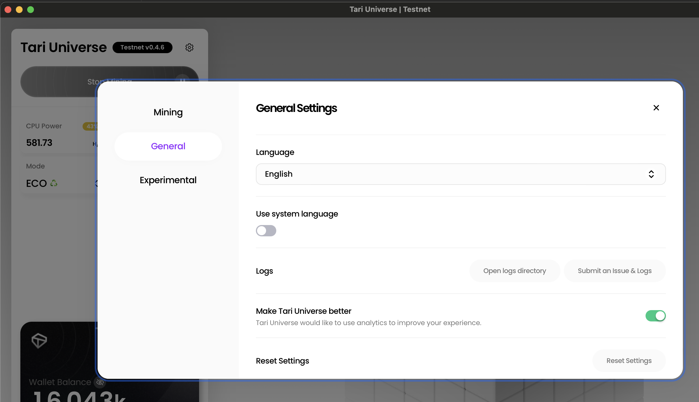
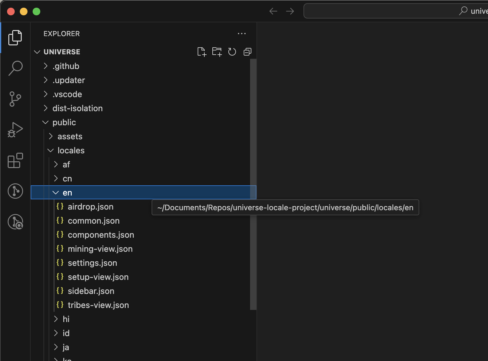
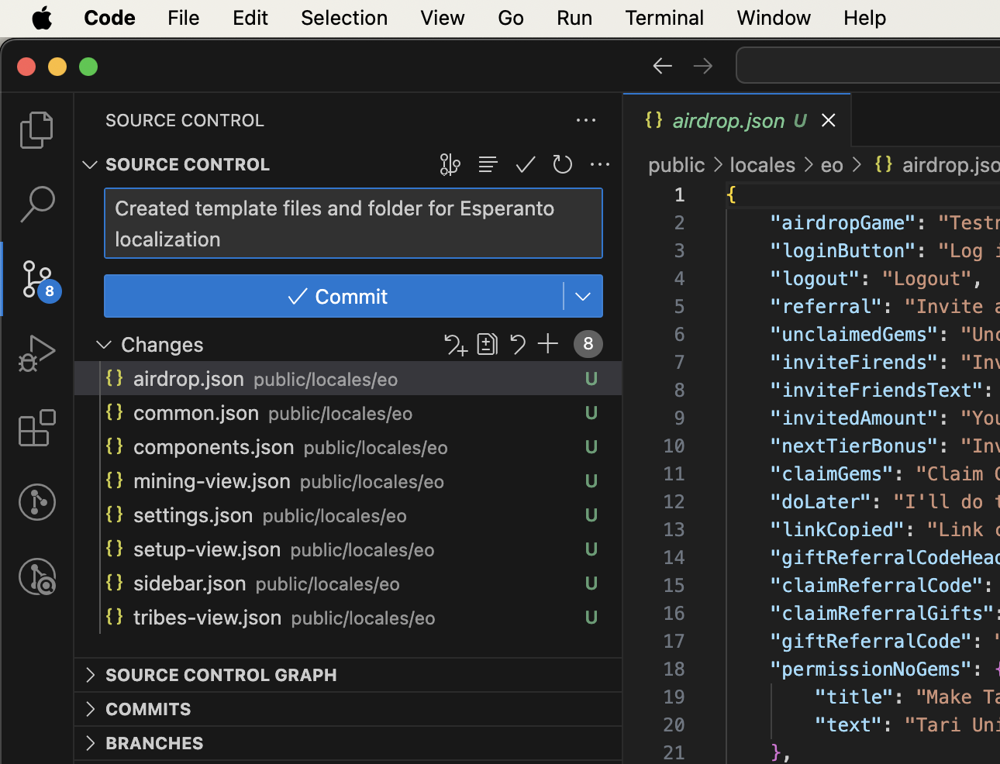
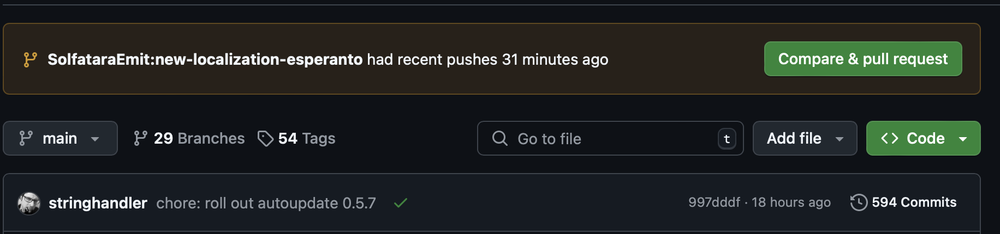

Tari Universe will use a user’s system locale to determine which language the application should use when launching for the first time. If the system locale is unavailable, the initial language displayed will be English. Users can, however, select their preferred language manually. This is important in making the application - and its various settings - understandable to a much larger audience.

Right now, we have a limited number of languages available; and with your help, we’d like to expand the selection. It’s a great way to dip your feet into the world of open-source projects, and contributing translations requires minimal programming skills (although perhaps this is a stepping stone to a whole new skill set?).

In this guide, we’ll explain how to go about contributing new languages - or localizations - to Tari Universe. 

# Getting started
To contribute your localization, you’ll need a couple of things:

* A GitHub account (recommended)
* A fork of the Tari Universe repository.

This is the bare minimum you require to contribute a new localization: you can use GitHub and/or git commands combined with a text editor of choice to work on your new localization either directly on GitHub or via a local repository.

However, this guide assumes the use of VS Code as your Integrated Development Environment (IDE). This has some additional prerequisites, such as installing the IDE itself and supporting applications such as git, nvm, cargo, and more.

Most of the above is covered in our [“How to Become a Tari Contributor” guide](/lessons/how_to_become_a_tari_contributor.html). It is recommended that you read through this guide first before you proceed with the rest of this guide.

In this guide, we’ll cover the following topics:
* Checking whether the localization you want to add already exists
* Creating a new branch within your forked repository to begin working on the new localization.
* Explain how localization works in Tari Universe
* Explain the purpose of the different localization files and factors to keep in mind for translating.
* Committing your localization for review and inclusion in Tari Universe via a pull request.

## Step 1 - Check the current localizations
The quickest way to do this is to go to the [Tari Universe “locales” folder](https://github.com/tari-project/universe/tree/main/public/locales) and look through the files and folders to see if the language you want to add already exists.

If it does, you can still contribute! Localization requires writers, proofreaders, and editors. You might notice spelling or grammatical errors, literal translations, or odd elements. If so, you can simply work in the existing locale and correct the current localization. We’ll explain this in more detail in Step 4.

## Step 2 - Creating a new branch for your localization work
You will need to create a new branch on your repository. Branching allows you to create a copy of the code at a point in time, allowing you to work on your specific changes without impacting the work of others. 

At the bottom-left corner of the screen, inside VS Code’s status bar, click on the “main” branch. In the Command Prompt, you will see that you have the option to create a new branch. Select the “Create Branch” option and give it an appropriate name. The standard convention is to avoid spaces and use hyphens in their place; for example, “new-localization-esperanto”. If you are editing an existing localization, this might change to, for example, “proofreading-french-localization”

Once you’ve created the branch, you will notice that the status bar’s branch has been updated to whatever you called your new branch. However, you will still need to publish the new branch to be able to view it in your remote list.

Click on the little cloud upload button next to the branch. In the Command Prompt, you will have the option of publishing it to Origin or Upstream (if you’re not familiar with these terms or understand what is being discussed, consult the “How to become a Tari Contributor” guide). Select Origin. You will now see the new branch in your list.

Congratulations! You’re now ready to start working on your localization.

# How does Tari’s language feature work?
Available languages for Tari Universe are available in a drop-down within the Settings → General Settings section of the application. The user can also select to use the system’s language (or locale) to determine which language Tari Universe will use.



These languages are derived from the Tari Universe project - specifically, from the ~/public/locales folder. Each locale consists of several JSON files stored in a folder that utilizes the ISO-639 standard Set 1 two-letter naming convention for countries. In VS Code, go to the Explorer Tab, expand the public/locales folder, then select the “en” locale folder.



Each JSON file corresponds to a different part of the app. Let’s have a look inside the “setup-view.json” file, that contains many of the start-up messages displayed when Tari Universe boots up.

# How the localization JSONs work

Below is a sample of the setup-view.json file:

```json
{
    "setting-up": "Setting up the Tari truth machine...",
    "this-might-take-a-few-minutes": "This might take a few minutes",
    "dont-worry": "Don't worry, next time it won't take as long",
    "title": {
        "starting-up": "Starting up",
        "checking-latest-version-gpuminer": "Checking for latest version of xtrgpuminer",
        "checking-latest-version-node": "Checking for latest version of node",
        "checking-latest-version-mmproxy": "Checking for latest version of mmproxy",
        "checking-latest-version-wallet": "Checking for latest version of wallet",
        "checking-latest-version-xmrig": "Checking for latest version of xmrig",
        "checking-latest-version-sha-p2pool": "Checking for latest version of sha-p2pool",
        "waiting-for-wallet": "Waiting for wallet",
        "waiting-for-node": "Waiting for node to sync",
        "preparing-for-initial-sync": "Connecting to network peers {{initial_connected_peers}}/{{required_peers}}",
        "starting-mmproxy": "Starting merge mining proxy",
        "starting-p2pool": "Starting P2Pool",
        "application-started": "Applications started",
        "downloading": "Downloading",
        "download-completed": "Download completed",
        "waiting-for-header-sync": "Waiting for header sync. {{local_height}}/{{tip_height}} headers synced",
        "waiting-for-block-sync": "Waiting for block sync. {{local_height}}/{{tip_height}} blocks synced"
    },
    "new-tari-version-available": "A new version of Tari Universe is available!",
    "would-you-like-to-install": "Would you like to install Tari Universe {{version}} now?",
    "yes": "Yes",
    "no": "No"
}
```

As we can see, “setup-view.json” consists of several variables that hook up to UI elements in Tari Universe. Text strings are stored against each variable, and Tari Universe displays that text. So while the variable name will always remain the same, the text string will change when a user selects a different locale.

Returning to the file, there are a couple of additional noteworthy elements to consider. Looking at the “title” variable, note several additional fields associated with it, starting with “starting-up” and continuing through to "waiting-for-block-sync". The “title” variable is a property whose text will change depending on the state of the variable; in this case, as Tari Universe gets to a new setup step, the title text will change to reflect the step it is currently on.

Lastly, some of the strings have text that is enclosed in braces, such as the string, “Would you like to install Tari Universe {{version}} now?”. These are variables that Tari Universe calls and inserts into displayed text so it can be dynamically updated. When editing these strings, ensure these remain unaltered.

## Step 3 - Duplicate an existing locale folder
The easiest way to get started is to duplicate one of the existing locale folders. You can skip this step if you are simply going to be editing an existing localization.

First, check what the ISO-639 Set 1 code is for the language you are adding. You can get a [full list here](https://en.wikipedia.org/wiki/List_of_ISO_639_language_codes).

Right-click on the locale folder in Explorer and select the “Create Folder” option. You will see a new, blank folder is created. Enter the two-letter code you noted earlier to create the folder.

Next, select all the files in the “en” folder, right-click, and select “Copy”. Then, open your newly created folder, right-click, and select “Paste”. The files will be copied into the folder as new files. 

Note that each of these files has a “U” against it. You need to commit these changes to your local repository so that VS Code can start tracking changes against the files.

> **_TIP:_** Commit changes often. Getting into the habit of committing your changes regularly ensures your changes are saved, making it easy to revert changes if required.

Go to the Source Control tab and open up the Changes panel. The new folder and files you created will be listed here. You will need to commit these changes to the repository. In the comment section, provide a short comment explaining what the changes are - an example would be “Created template files and folder for Esperanto localization” - and press the “Commit” button.

> **_TIP:_** While not necessary, Tari uses the conventional commits standard for commits. [A quick cheatshet is available here](https://gist.github.com/qoomon/5dfcdf8eec66a051ecd85625518cfd13). You will likely be mostly using feat, fix, and chore.



You’ll be warned that this is not a staged commit and asked if you wish to commit this directly. Select “Yes” to continue. You’ll notice that the “Commit” button has changed to “Sync changes.” Doing this will sync the commits you’ve made to your remote repository on GitHub. You can click “Sync Changes” immediately, or make some additional commits before syncing.

## Step 4 - Edit the JSON files
If you have started a new localization, open the files created in the previous step. Otherwise, locate the existing localization you would like to edit and open those files. Regardless of what you’re doing, as you work through, save frequently and commit your changes, syncing as necessary. As you work, please keep the following guidelines in mind:
* If possible, avoid machine translation. While workable, being fluent in the language is preferable.
* Proofread your work to catch any errors you may introduce.
* Do not translate specific references to underlying services, applications, or technologies. For example, xmrig and p2pool should be referred to as such regardless of the language being used.
* Do not change any text that is within braces e.g. {{version}}

Below, you can find a description of what each JSON file affects within Tari Universe:
|**File**|**Description**|
|--------|---------------|
|airdrop.json| Fields related to the Tari Airdrop game integration in Tari Universe|
|common.json | Common terms used across the application, such as "version" and "hashrate" |
|components.json| Component failure messages |
|mining-view.json| UI of the main screen, and the status of the mining button |
|settings.json| Text related to the Settings component of Tari Universe |
|setup-view.json| Messages displayed when Tari Universe is booting up |
|sidebar.json| UI elements in the sidebar of the main Tari Universe screen |
|tribes-view.json| The title for the Squad View section in Settings. |

## Step 5 - Creating a pull request (PR) for your localization
Once you’ve completed your localization changes, you will need to submit them via a pull request (PR) - essentially, an official Git request that asks the main project maintainers to review and incorporate your localization into the main project.

Before you begin this process, confirm that you have committed and synced all of your changes and double-check that no new locale variables have been added to the JSON files.

The easiest way to create a PR is via GitHub. Go to your fork on GitHub and make sure you have your branch selected. A message below the main title of the project will indicate that changes have been made, and give you an option to compare and create a PR.



Click on the “Compare & Pull Request” button to open the “Open a Pull Request” screen. The first thing to note is the block showing you which repositories and branches are being compared, and the direction of the changes. Yours should show an arrow pointing from your repository/branch to the main project, which indicates that this PR is about pulling your changes into the main project.


Below this is the form for capturing details about the PR. Follow these conventions when providing information:
The title of the PR should read, “feat: added new localization for [your language]”
By default, GitHub has a standard template for capturing details against the PR. It’s best to follow the template when capturing info.
Below the form and submission button is a summary of the changes that are being made.

Once you have completed the form, press the “Create pull request” button. This will both create a pull request and notify the maintainers that your code should be reviewed.

> **_TIP:_** Once a PR has been submitted, be sure to follow up on the PR regularly. Reviewers may have questions or changes that need to be reviewed by you before they can continue. In this case, they will assign the PR back to you for action.

If the maintainers are happy with your additions, they will accept the PR and merge it into the main project. It might still be some time until the localization is incorporated into the main interface.

# Conclusion
Adding new localizations, or improving existing ones, ensures Tari Universe is easily useable by a wide audience.


