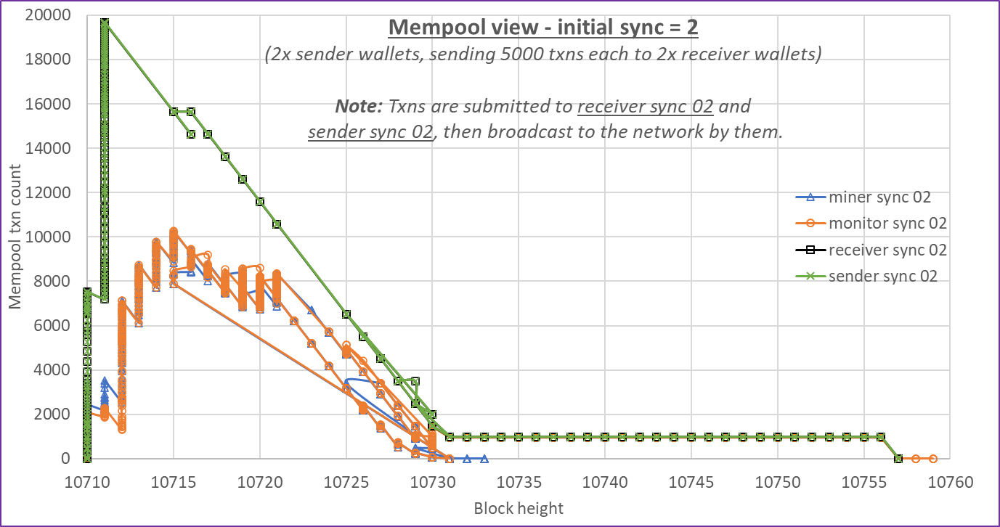
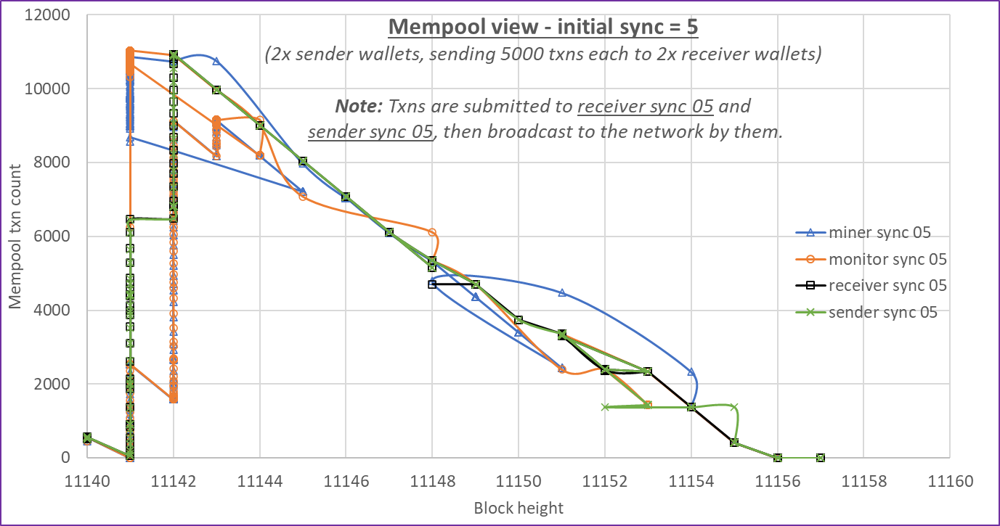

## Overview

Stress tests are a perfect tool to simulate main net conditions and accelerate any latent issues we may have.
For example, suppose a system runs well when having an average of `X` number of transactions per second when nicely
proportioned; thus, the transaction input vs. transaction output count is in the same order of magnitude, and all
transactions are spread out evenly across all the blocks. Such a system may not handle stressful conditions all that
well. We have been performing three types of stress tests so far to stress all aspects of the base layer network:

- Coin-splits (this relates to transactions with a single input but a vast number of outputs).
- Spending dust (this relates to transactions with a vast number of inputs but only one or two outputs).
- Transactions to peer wallets (this relates to transactions with a single input and only one or two outputs):
    - interactive;
    - one-sided;
    - one-sided stealth.

When performing a stress test, the aim is to fill up the mempools in all the base nodes with a vast transaction backlog
of a specific or mixed transaction type. In general, only a couple of wallets linked to their exclusive base nodes are
needed - some to send transactions and others to receive transactions. When dealing with such a vast number of
transactions, we need to keep the mempool filled up for a long time, and it will also stress the participating wallets
simultaneously. Wallets and base nodes participating in generating the transactions are configured to use TCP
communication amongst each other in a private network instead of doing everything via TOR, but all external
communication still uses TOR. In most cases, a high-end desktop workstation or laptop can only accommodate three or
four wallet-base node pairs.

We have performed numerous stress tests in the past, with the
[reports available here](https://github.com/tari-project/tari-data-analysis/tree/master/reports).
Some of the more recent stress tests we performed are discussed below.

## Coin splits

We have performed many coin-split stress tests; this is by far the easiest method to add hundreds of thousands of new
UTXOs to the network. This also sets the stage for performing the other types of stress tests.

## Mempool sync

In the past, we have noticed that mempool sync was not always that great when conducting stress tests, meaning that
mempools will have different views of the unmined transactions in the network. This poses a big problem in that often
base nodes are connected to miner nodes, thus having the job of supplying miners with block templates filled with
transactions are not aware of thousands of unmined transactions.

The test configuration used was for two sender wallets sending 5,000 normal transactions to each of two receiver
wallets, thus 20,000 transactions in total. In this test, we aimed to analyze the mempool sync behaviour so that a
permanent solution could be implemented.

The first test shows the effect when any new base node starting up tries to sync from two peers. We can see that it
took 47 blocks to mine all transactions as the miner node was starved of transactions for a long time. Base nodes
connected to the sender and receiver wallets had a different view of the unmined transactions in the network.

The second test shows the effect when any new base node starting up tries to sync from five peers. Note that by changing
the startup sync behaviour, all transactions were mined within 16 blocks, and all base node mempools had a similar view
of the unmined transactions in the network.

At the time of the stress test, we did not have an active mempool sync strategy implemented but rather relied on the
connection paths between all wallets and base nodes to get a broadcasted transaction to all mempools. _This has now
been fixed, and mempool sync is not an issue anymore._

## 48,000 normal interactive transactions, the biggest yet

In the past, we used six sender wallets on two computers to send 36,000 normal transactions collectively to ten
receiver wallets. In this test, we wanted to stress the wallet database itself. The test configuration was for
three senders' wallets on one computer, each sending 16,000 transactions to 4x receiver wallets on another computer,
each receiving 12,000 transactions. The aim was to try and starve/lock up the wallet database (as it can easily handle
smaller batches) and stress the network overall.

We had eight base node-wallet pairs running - seven participating in the test and one acting as a miner with SHA3 and
XMRig mining. Four base nodes crashed (later fixed with [#4784](https://github.com/tari-project/tari/pull/4784)) during the test, so those had to be
restarted once. All eight base nodes were configured to sync mempools from five peers and re-sync when
they fell five blocks behind; none of the base nodes lagged with chain sync for any type of extended period; they
always caught up again. (This test effectively closed [#3115](https://github.com/tari-project/tari/pull/3115)).

All in all, the wallets performed admirably. The following stats were collected from the completed transactions table
for each wallet, representing those wallet's view of the truth.

| Wallet      | Total sent | Total expected | Rejected | Unaccounted for | Pending | Mined confirmed |         |
| ----------- | ---------- | -------------- | -------- | --------------- | ------- | --------------- | ------- |
| Sender 01   | 16000      | 0              | 10       | 0               | 0       | 15990           | 99,938% |
| Sender 02   | 16000      | 0              | 0        | 4               | 0       | 15996           | 99,975% |
| Sender 03   | 16000      | 0              | 0        | 5               | 0       | 15995           | 99,969% |
| Receiver 01 | 0          | 12000          | 0        | 0               | 1       | 11999           | 99,992% |
| Receiver 02 | 0          | 12000          | 1        | 1               | 0       | 11998           | 99,983% |
| Receiver 03 | 0          | 12000          | 0        | 3               | 1       | 11996           | 99,967% |
| Receiver 04 | 0          | 12000          | 0        | 1               | 1       | 11992           | 99,933% |
| Totals      | 48000      | 48000          | 11       | 14              | 3       | 95966           | 99,965% |

## Summary

Stress testing has been a valuable tool in the past and continues to be so, as proved by the recent improvements made
to analyze and improve certain behaviours or to discover the occasional not expected bug that would have remained
hidden during testnet. Thank you to everyone running a base node or base node and miner combination that makes stress
testing possible.
